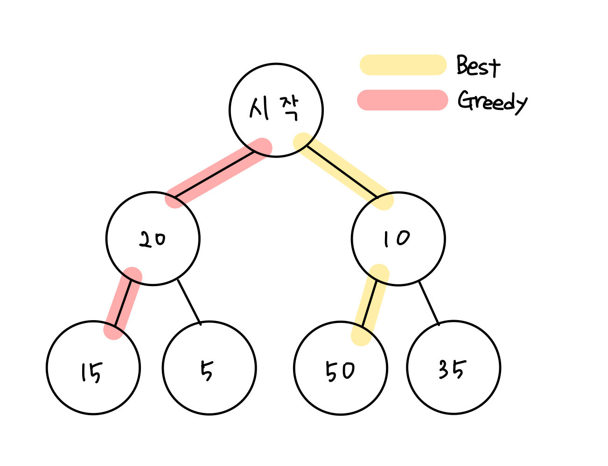

## 1. 그리디(Greedy) 알고리즘

<br/>

**현재 상황에서 지금 당장 좋은 것만 고르는 방법**



위의 그림과 같이 그리디 알고리즘은 `최적의 해`를 찾을 수 없을 가능성이 많다.  
따라서 그리디 알고리즘은 사전에 외우고 있지 않아도 풀 수 있지만 그리디 외 다른 알고리즘으로 풀어야 더 효율적인 문제들도 많으니 어떤 문제에서 그리디를 사용할지 정확히 알아야한다.

<br/>

### **최적 해가 되는 조건**  
1. 탐욕 선택 속성: 이전 단계의 선택이 다음 단계의 선택과 완전히 무관  
2. 최적 부분 구조: 문제의 최적 해가 부분 문제 최적 해의 모임으로 구성  


<br/>

문제에서 `가장 큰 순서대로`, `가장 작은 순서대로`와 같은 기준이 있으면 그리디를 생각해봐야한다.  
예를 들어 **거스름돈 문제** 가 있다.

<br/>

> **🤑 거스름돈 문제**  
> <거스름돈을 거슬러줄 때, 거슬러 줄 동전의 최소 개수를 구하는 것.>  
> 풀이 방법은 `가장 큰 화폐 단위` 부터 최대한 많이 거슬러주는 것이다.  
> 따라서 화폐의 종류가 K개라고 하면 화폐의 종류만큼 반복해야하므로 **시간 복잡도는 O(K)** 이다.

<br/>

앞에서 그리디 알고리즘을 설명한 것과 같이 그리디 알고리즘은 `최적의 해`를 찾을 수 없을 가능성이 많다. 하지만 **거스름돈 문제** 처럼 정확한 답(최적의 해)을 찾을 수 있다는 보장이 있을 때는 매우 효과적이고 직관적이다.

따라서 그리디 알고리즘을 사용할 땐 그 방법이 정확한 답을 찾아주는지 검토해야한다.

<br/>

참고로, 만약 바로 문제 유형을 파악하기 힘든 문제를 만나면 그리디 알고리즘을 한번쯤은 의심해보는 것이 좋다.


<br/>

나동빈님의 '이것이 코딩테스트다'를 참고하여 공부했습니다.

```toc

```
